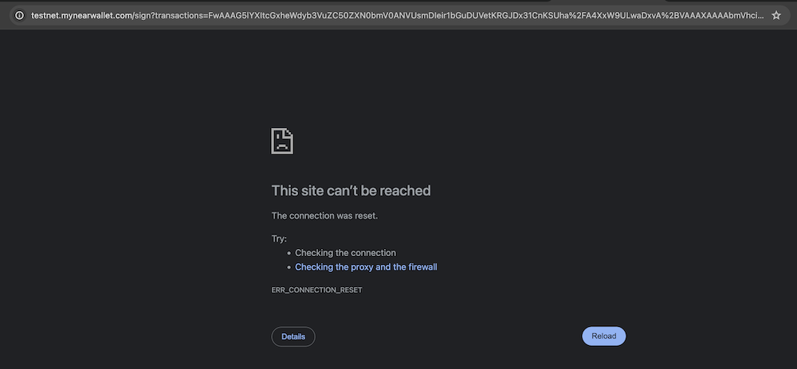
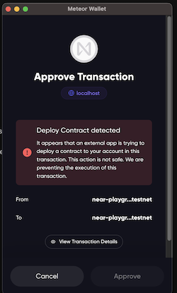

# Why We Need Your Seed Phrase / Private Key to Deploy the Smart Contract

## Reason & Cause

### Not All Wallets Support Testnet

This project is an unaudited project created by an indie programmer as a hobby to experiment with Near Protocol smart contract capabilities. For safety reasons, I strongly advise against testing this project in the mainnet environment, as it can be dangerous.

Many wallets (such as Bitget and HereWallet) do not support the Near Protocol testnet.

---

### Limitations of URL Length

Most wallets (such as MyNearWallet and MintbaseWallet) use GET parameters from HTTP requests to accept transactions from the wallet selector. However, URL lengths are capped at 2048 characters, which can be problematic. Our contract, which exceeds 500KB, can easily surpass this limit, making it impossible to pass it to the selected wallet.

The screenshot below shows how MyNearWallet looks when trying to deploy the contract:

---

### Security Considerations by some wallet

Some wallets (such as MeteorWallet) pass data between browser windows, bypassing the URL length limit. However, these wallets may refuse to sign a deploy contract transaction.

The screenshot below shows how MeteorWallet looks when trying to deploy the contract:

---

## Alternative Solutions

You can also download the smart contract then deploy it using `near-cli`

[Smart Contract Download Link](../public/near_playground_account.wasm)
